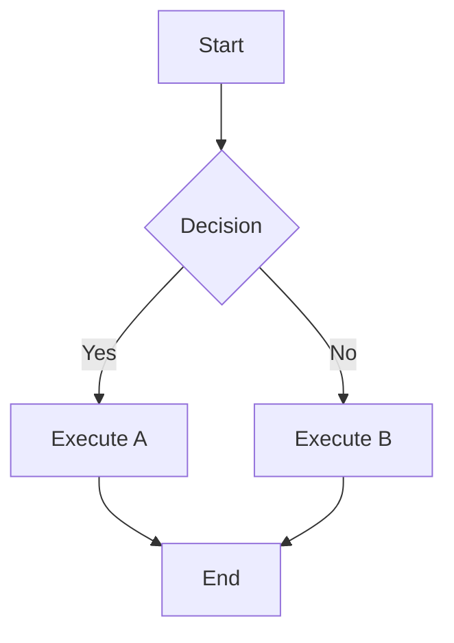
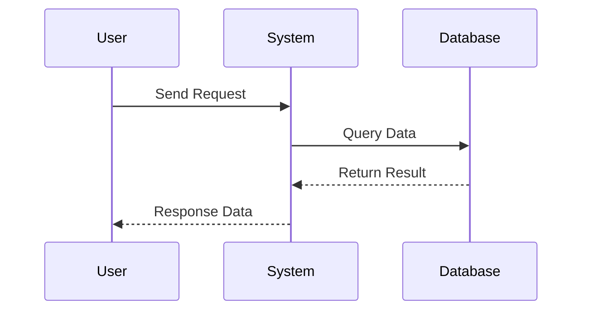
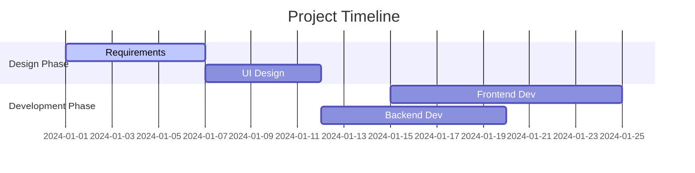
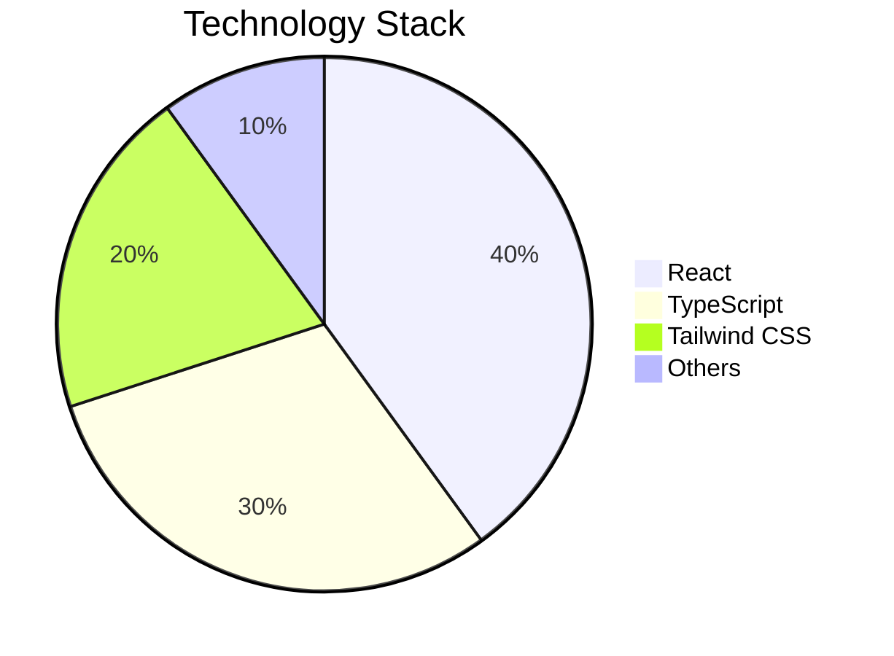
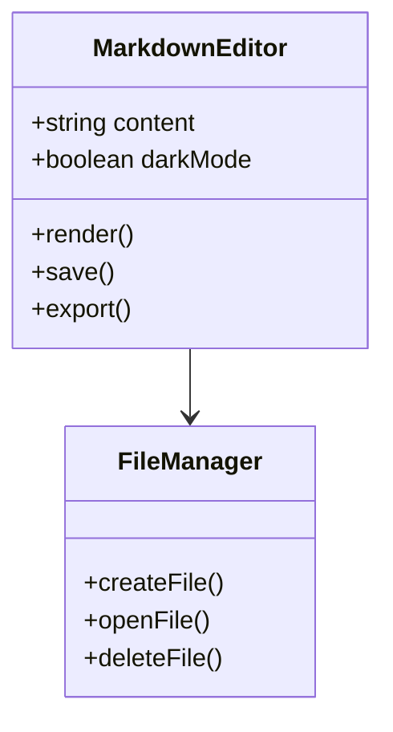
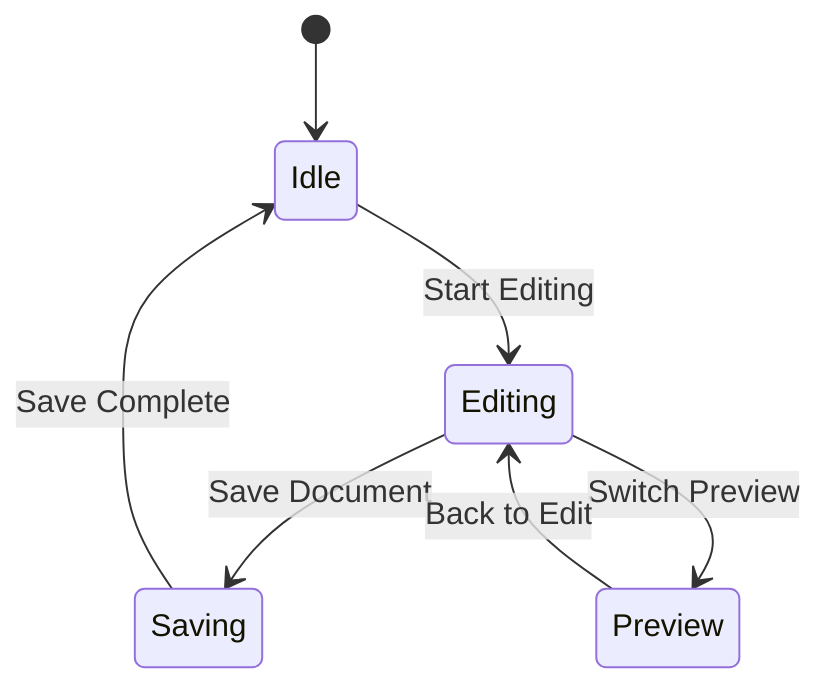
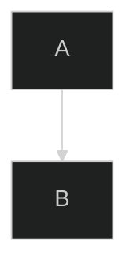
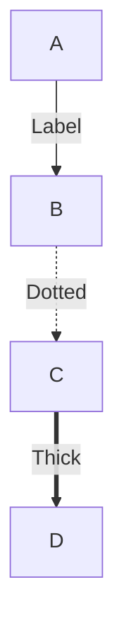
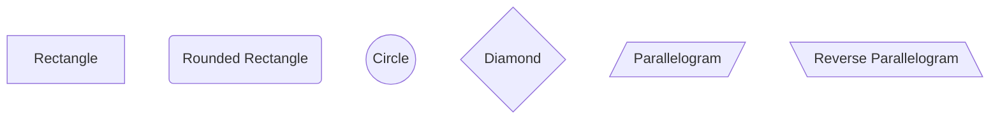

# Flowchart

MarkFlow Lite supports creating various types of flowcharts and diagrams using Mermaid syntax.

## 📊 Supported Chart Types

### Flowchart



### Sequence Diagram



### Gantt Chart



### Pie Chart



### Class Diagram



### State Diagram



## 🎨 Chart Customization

### Theme Settings

Mermaid supports multiple themes:

- `default` - Default theme
- `dark` - Dark theme
- `forest` - Forest theme
- `neutral` - Neutral theme

### Custom Configuration

Add configuration at the beginning of your document:

```markdown

```

## 📝 Usage Tips

### 1. Basic Syntax

- Use `graph TD` for top-to-bottom flowcharts
- Use `graph LR` for left-to-right flowcharts
- Use `[]` for rectangles, `()` for rounded rectangles, `{}` for diamonds

### 2. Connection Styles



### 3. Node Styles



### 4. Color Settings

```mermaid
graph TD
    A[Start]
    B[Process]
    C[End]
    
    A --> B
    B --> C
    
    classDef start fill:#e1f5fe
    classDef process fill:#fff3e0
    classDef end fill:#f3e5f5
    
    class A start
    class B process
    class C end
```

## 🚀 Best Practices

### 1. Keep It Simple

- Avoid too many elements in a single chart
- Use clear labels and naming
- Arrange layout to avoid overlapping

### 2. Semantic Design

- Use meaningful node names
- Add appropriate comments and descriptions
- Maintain consistent colors and styles

### 3. Responsive Design

- Consider display on different screen sizes
- Avoid overly wide charts
- Use appropriate font sizes

## 🔗 Related Links

- [Mermaid Official Documentation](https://mermaid.js.org/)
- [Back to Features](./index)
- [Math Formulas](./math)
- [Theme Settings](./themes)
