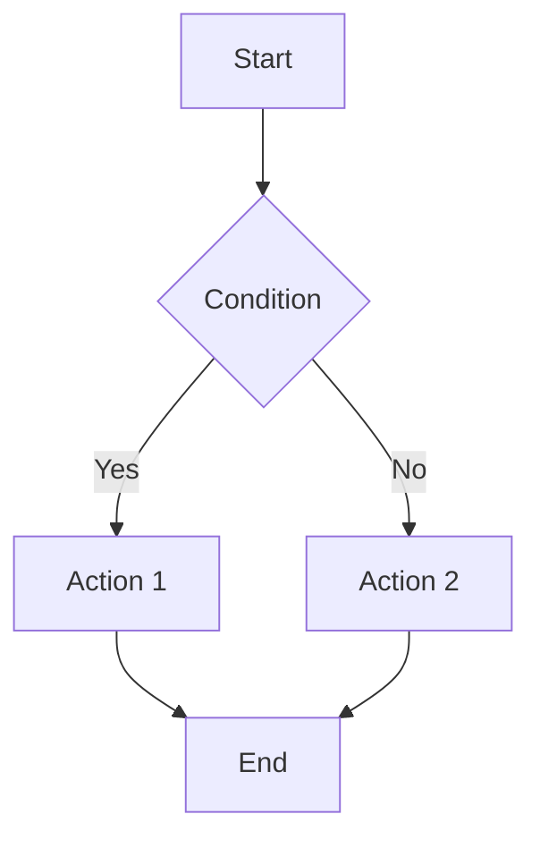
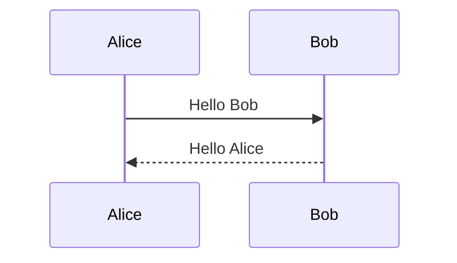

# Markdown Support

MarkFlow Lite provides complete and powerful Markdown support, making your document writing more efficient and professional.

## 📝 Basic Syntax

### Headers

```markdown
# Heading 1
## Heading 2
### Heading 3
#### Heading 4
##### Heading 5
###### Heading 6
```

### Text Styles

```markdown
**Bold text**
*Italic text*
~~Strikethrough~~
***Bold and italic***
`Inline code`
```

### Paragraphs and Line Breaks

```markdown
This is a paragraph.

This is another paragraph with a blank line in between.

This is content on the same line,  
here two spaces are used for line break.
```

### Lists

#### Unordered Lists
```markdown
- Item 1
- Item 2
  - Subitem 2.1
  - Subitem 2.2
- Item 3

* Can also use asterisks
+ Or plus signs
```

#### Ordered Lists
```markdown
1. First step
2. Second step
3. Third step
   1. Substep 3.1
   2. Substep 3.2
```

#### Task Lists
```markdown
- [x] Completed task
- [ ] Uncompleted task
- [ ] Another task
  - [x] Subtask completed
  - [ ] Subtask uncompleted
```

### Links and Images

```markdown
[Regular link](https://example.com)
[Link with title](https://example.com "Link title")
[Relative link](../path/to/file.md)
[Anchor link](#heading)


```

### Blockquotes

```markdown
> This is a blockquote
> Can have multiple lines of content
>
> > Nested quote
> > Supports multiple levels of nesting

> ### Heading in quote
> 
> - List in quote
> - More items
> 
> **Bold text in quote**
```

### Code

#### Inline Code
```markdown
Use `console.log()` to output debug information.

Shortcut key `Ctrl + C` can copy content.
```

#### Code Blocks
\```javascript
function hello() {
    console.log("Hello, World!");
    return "success";
}
\```

\```python
def fibonacci(n):
    if n <= 1:
        return n
    return fibonacci(n-1) + fibonacci(n-2)
\```

\```bash
# Install dependencies
npm install

# Start development server
npm run dev
\```

### Tables

```markdown
| Name | Age | City |
|------|-----|------|
| Zhang San | 25 | Beijing |
| Li Si | 30 | Shanghai |
| Wang Wu | 28 | Guangzhou |

| Left Align | Center Align | Right Align |
|:-----------|:------------:|------------:|
| Content1   |   Content2   |     Content3 |
| Content4   |   Content5   |     Content6 |
```

### Horizontal Rules

```markdown
---

***

___
```

## 🚀 Extended Syntax

### Footnotes

```markdown
This is a sentence with a footnote[^1].

Another footnote example[^longnote].

[^1]: This is the content of the first footnote.
[^longnote]: This is a longer footnote,
    which can contain multiple lines of content.
```

### Definition Lists

```markdown
Term 1
:   Definition 1

Term 2
:   Definition 2a
:   Definition 2b

HTML
:   HyperText Markup Language

CSS
:   Cascading Style Sheets
```

### Abbreviations

```markdown
*[HTML]: HyperText Markup Language
*[CSS]: Cascading Style Sheets

HTML and CSS are the foundation of web development.
```

### Subscript and Superscript

```markdown
Subscript text: ~subscript~
Superscript text: ^superscript^
H~2~O is water
E = mc^2^
```

### Highlight

```markdown
==This is highlighted text==

Normal text with ==highlighted part==.
```

## 🎨 Advanced Features

### Emoji Support

```markdown
:smile: :heart: :thumbsup:
:fire: :star: :rocket:

Emojis can be used directly 😀 😍 🎉
```

### Enhanced Task Lists

```markdown
- [x] Completed task ✅
- [ ] Uncompleted task ⬜
- [-] Task in progress 🔄
- [>] Forwarded task ⏩
```

### Containers and Alerts

```markdown
::: tip Tip
This is a tip box
:::

::: warning Warning
This is a warning box
:::

::: danger Danger
This is a danger warning box
:::

::: details Click to view details
This is hidden content
:::
```

### Chart Support

```markdown



```

## 🔧 Configuration Options

### Parser Configuration

```javascript
const markdownIt = require('markdown-it')({
    html:         true,        // Enable HTML tags
    xhtmlOut:     false,       // Use '/' to close single tags
    breaks:       false,       // Convert '\n' to '<br>'
    langPrefix:   'language-',  // CSS language prefix
    linkify:      true,        // Auto-convert URLs to links
    typographer:  true,        // Enable smart quotes etc.
    
    // Components
    highlight: function (str, lang) {
        if (lang && hljs.getLanguage(lang)) {
            try {
                return hljs.highlight(str, { language: lang }).value;
            } catch (__) {}
        }
        return ''; // Use external default escape
    }
});
```

### Extension Plugins

```javascript
// Table plugin
const markdownItTable = require('markdown-it-table');

// Task list plugin
const markdownItTaskLists = require('markdown-it-task-lists');

// Footnote plugin
const markdownItFootnote = require('markdown-it-footnote');

// Definition list plugin
const markdownItDeflist = require('markdown-it-deflist');

// Abbreviation plugin
const markdownItAbbr = require('markdown-it-abbr');

// Subscript/Superscript plugin
const markdownItSub = require('markdown-it-sub');
const markdownItSup = require('markdown-it-sup');

// Highlight plugin
const markdownItMark = require('markdown-it-mark');

// Math formula plugin
const markdownItMath = require('markdown-it-math');
```

## 🎯 Best Practices

### Writing Suggestions

1. **Clear Structure**: Use appropriate heading levels
2. **Semantic**: Use correct Markdown syntax to express semantics
3. **Consistency**: Maintain consistency in document style
4. **Readability**: Use blank lines and indentation appropriately

### Performance Optimization

1. **Avoid Excessive Nesting**: Too deep nesting will affect rendering performance
2. **Use Extended Syntax Reasonably**: Only use extended syntax when needed
3. **Image Optimization**: Compress images and use appropriate formats
4. **Cache Strategy**: Use cache to improve rendering speed

### Compatibility Considerations

1. **Standard First**: Prioritize standard Markdown syntax
2. **Progressive Enhancement**: Add extended features on standard basis
3. **Fallback Handling**: Provide fallback solutions for renderers that don't support extended syntax
4. **Test Validation**: Test rendering effects in different environments

## 🐛 Common Issues

### Syntax Not Working

1. **Check Syntax**: Ensure syntax is correct
2. **Check Plugins**: Confirm related plugins are enabled
3. **Check Configuration**: Verify parser configuration
4. **Check Version**: Ensure using supported syntax version

### Rendering Abnormalities

1. **Character Encoding**: Confirm file encoding is UTF-8
2. **Special Characters**: Escape special characters
3. **HTML Conflicts**: Avoid conflicts between Markdown and HTML
4. **Style Conflicts**: Check CSS style effects

### Performance Issues

1. **Document Too Large**: Split large documents
2. **Too Many Images**: Optimize image sizes
3. **Complex Syntax**: Simplify complex syntax structures
4. **Rendering Frequency**: Control rendering frequency

## 🎨 Example Document

### Complete Example

```markdown
---
title: MarkFlow Lite User Manual
date: 2024-01-01
author: MarkFlow Team
tags: [markdown, editor, documentation]
---

# MarkFlow Lite User Manual

## Overview

MarkFlow Lite is a **pure front-end** Markdown editor that supports real-time preview, mathematical formulas, flowcharts, and more.

## Main Features

### 1. Real-time Editing
- ✅ WYSIWYG editing
- ✅ Syntax highlighting display
- ✅ Auto-save function

### 2. Rich Export
| Format | Features | Usage |
|--------|----------|-------|
| PDF | Fixed format | Formal documents |
| HTML | Interactive | Web publishing |
| Markdown | Plain text | Version control |

### 3. Cloud Storage Support
1. AWS S3
2. WebDAV
3. Local storage

## Quick Start

```bash
# Install
npm install markflow-lite

# Start
npm run dev
```

## Mathematical Formulas

Inline formula: $E = mc^2$

Block formula:
$$
\int_{-\infty}^{\infty} e^{-x^2} dx = \sqrt{\pi}
$$

## Flowchart


---

*Happy Writing!* 🚀
```

## 🎯 Next Steps

- [Flowchart](./flowchart) - Learn to create various diagrams
- [Math Formulas](./math) - Master mathematical formula rendering
- [Theme Switching](./themes) - Personalize your interface
- [Shortcuts](./shortcuts) - Improve editing efficiency

## 📚 Related Resources

- [CommonMark Specification](https://commonmark.org/)
- [GitHub Flavored Markdown](https://github.github.com/gfm/)
- [Markdown Extended Syntax](https://markdown-it.github.io/)
- [Markdown Tutorial](https://www.markdownguide.org/)

---

**Tip**: MarkFlow Lite supports complete Markdown syntax and multiple extensions. You can choose appropriate syntax to write documents according to your needs.

**Suggestion**: Maintain consistency in syntax, which will make your documents more professional and readable."}