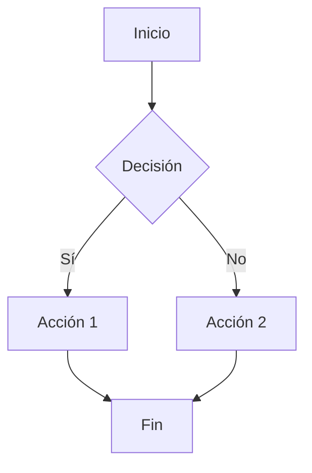

# Uso Básico

Una vez que hayas configurado MarkFlow Lite, aquí tienes una guía completa sobre cómo usar todas sus características.

## 🖥️ Interfaz Principal

### Layout de la Aplicación
```
┌─────────────────────────────────────────────────┐
│                    Header                       │
├──────────────┬──────────────────┬───────────────┤
│   Árbol de   │     Editor de    │   Vista       │
│   Archivos   │     Markdown     │   Previa      │
│              │                  │               │
├──────────────┼──────────────────┼───────────────┤
│              │   Barra de       │               │
│              │   Estado         │               │
└──────────────┴──────────────────┴───────────────┘
```

### Componentes Principales
- **Header**: Barra de herramientas principal
- **Árbol de Archivos**: Navegación de documentos (izquierda)
- **Editor**: Área de edición de Markdown (centro)
- **Vista Previa**: Renderizado en tiempo real (derecha)
- **Barra de Estado**: Información del documento (abajo)

## ✏️ Edición de Markdown

### Sintaxis Básica
```markdown
# Título 1
## Título 2
### Título 3

**Negrita** y *cursiva*
~~Tachado~~ y `código inline`

- Lista desordenada
  - Sublista
1. Lista ordenada
2. Segundo elemento

[Enlace](https://ejemplo.com)


> Cita de texto
> Segunda línea

---

Tabla | Columna 2
------|----------
Fila 1| Contenido
Fila 2| Más contenido
```

### Características Avanzadas

#### Fórmulas Matemáticas (KaTeX)
```latex
Inline: $E = mc^2$

Bloque:
$$
\int_{-\infty}^{\infty} e^{-x^2} dx = \sqrt{\pi}
$$
```

#### Diagramas (Mermaid)


#### Bloques de Código con Resaltado
```javascript
function saludar(nombre) {
    console.log(`¡Hola, ${nombre}!`);
    return true;
}

// Llamar a la función
saludar("Mundo");
```

## 🎨 Personalización

### Temas
1. **Tema Claro**: Fondo blanco, texto negro
2. **Tema Oscuro**: Fondo oscuro, texto claro
3. **Automático**: Sigue la configuración del sistema

### Configuración del Editor
- **Tamaño de fuente**: 12px - 24px
- **Familia de fuente**: Monospace, Sans-serif, Serif
- **Números de línea**: Mostrar/Ocultar
- **Word wrap**: Activar/Desactivar
- **Indentación**: Espacios o tabs

### Vista Previa
- **Estilo CSS**: Múltiples estilos predefinidos
- **Ancho máximo**: Personalizable
- **Sincronización de scroll**: Activar/Desactivar

## 📁 Gestión de Archivos

### Crear Nuevo Archivo
1. Haz clic en "Nuevo Archivo" en la barra de herramientas
2. Introduce un nombre para el archivo
3. Comienza a escribir en el editor

### Abrir Archivos Existentes
- **Desde disco**: Arrastra y suelta archivos
- **Desde la nube**: Conecta servicios de almacenamiento
- **Archivos recientes**: Lista de documentos recientes

### Guardar Archivos
- **Autoguardado**: Se guarda automáticamente cada 30 segundos
- **Guardado manual**: Ctrl+S (Cmd+S en Mac)
- **Guardar como**: Ctrl+Shift+S

### Organización
- **Carpetas**: Crea estructura de directorios
- **Tags**: Etiqueta documentos para búsqueda fácil
- **Favoritos**: Marca documentos importantes

## 🔍 Búsqueda y Navegación

### Búsqueda en Documento
- **Buscar**: Ctrl+F
- **Buscar y reemplazar**: Ctrl+H
- **Expresiones regulares**: Soporte completo
- **Búsqueda sensible a mayúsculas**: Opcional

### Navegación Rápida
- **Ir a línea**: Ctrl+G
- **Navegación de títulos**: Panel de esquema
- **Breadcrumbs**: Ruta de navegación
- **Minimap**: Vista general del documento

## 🚀 Atajos de Teclado

### Generales
| Atajo | Acción |
|-------|--------|
| `Ctrl + N` | Nuevo archivo |
| `Ctrl + O` | Abrir archivo |
| `Ctrl + S` | Guardar |
| `Ctrl + Shift + S` | Guardar como |
| `Ctrl + Z` | Deshacer |
| `Ctrl + Y` | Rehacer |

### Edición
| Atajo | Acción |
|-------|--------|
| `Ctrl + X` | Cortar línea |
| `Ctrl + C` | Copiar línea |
| `Ctrl + V` | Pegar |
| `Ctrl + D` | Duplicar línea |
| `Ctrl + L` | Seleccionar línea |
| `Alt + ↑/↓` | Mover línea |

### Formato
| Atajo | Acción |
|-------|--------|
| `Ctrl + B` | **Negrita** |
| `Ctrl + I` | *Cursiva* |
| `Ctrl + K` | Crear enlace |
| `Ctrl + Shift + K` | Eliminar línea |

### Vista
| Atajo | Acción |
|-------|--------|
| `Ctrl + +` | Aumentar zoom |
| `Ctrl + -` | Disminuir zoom |
| `Ctrl + 0` | Resetear zoom |
| `F11` | Pantalla completa |

## 🔄 Sincronización y Colaboración

### Modo Sin Conexión
- Todos los archivos disponibles sin internet
- Sincronización automática al reconectar
- Indicador de estado de conexión

### Función de Respaldo
- **Historial de versiones**: Hasta 50 versiones por archivo
- **Recuperación automática**: Restaura trabajo perdido
- **Exportación de respaldo**: Descarga todos los datos

### Compartir Documentos
- **Enlaces públicos**: Genera URLs compartibles
- **Modo solo lectura**: Para revisión
- **Exportar**: HTML, PDF, Markdown

## 💡 Consejos de Productividad

### Organización del Trabajo
1. **Usa estructura de carpetas** para proyectos grandes
2. **Aplica tags consistentes** para búsqueda fácil
3. **Aprovecha los snippets** para texto repetitivo
4. **Configura plantillas** para tipos de documento comunes

### Optimización del Flujo de Trabajo
1. **Memoriza atajos clave** para operaciones frecuentes
2. **Usa vista dividida** para comparar documentos
3. **Activa la vista previa automática** para feedback inmediato
4. **Configura el autoguardado** frecuente para seguridad

### Mejores Prácticas
1. **Estructura clara de títulos** para navegación fácil
2. **Enlaces internos** para conectar documentos relacionados
3. **Imágenes optimizadas** para mejor rendimiento
4. **Consistencia en el estilo** para profesionalismo

¿Listo para funciones más avanzadas? Continúa con [Almacenamiento en la Nube](./cloud-storage) o [Exportación](./export).
