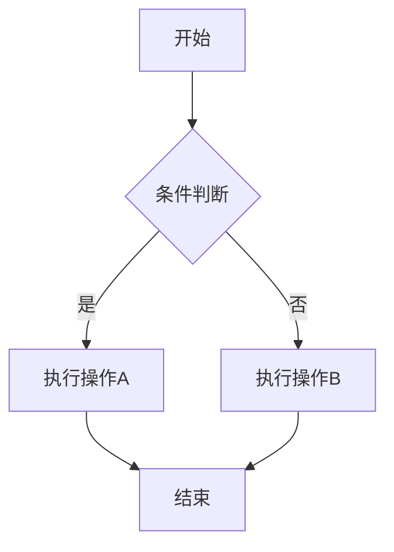
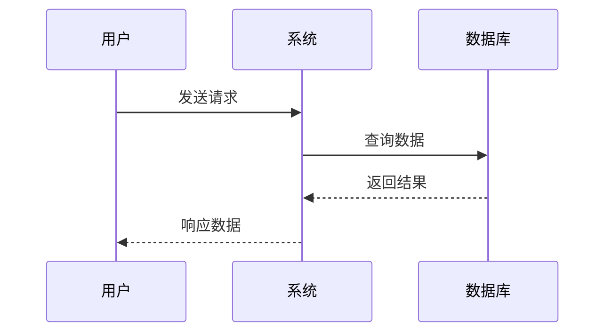
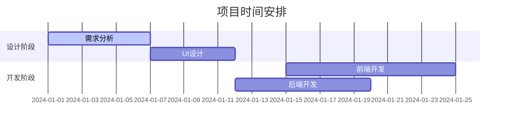
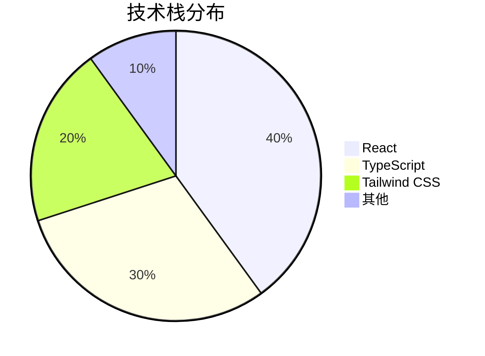
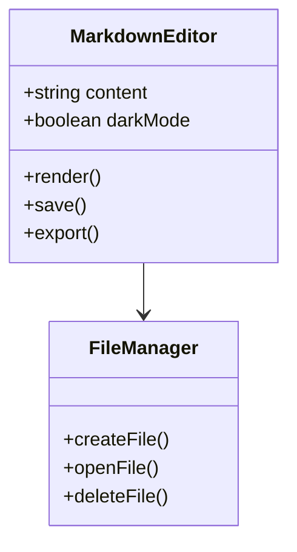
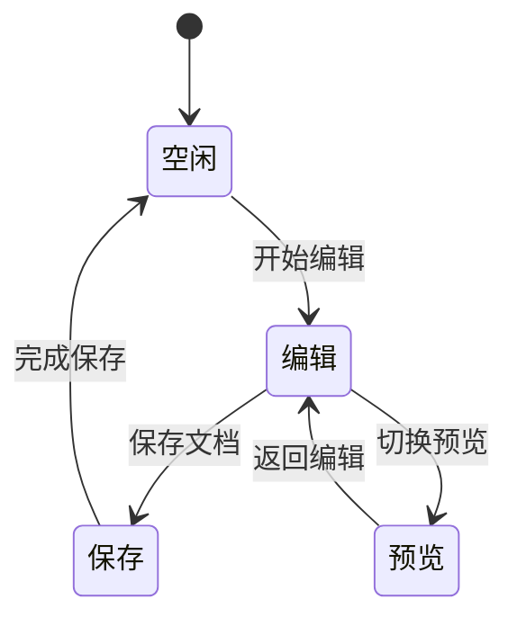
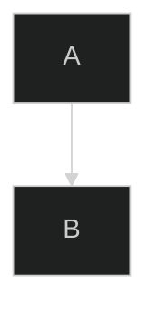
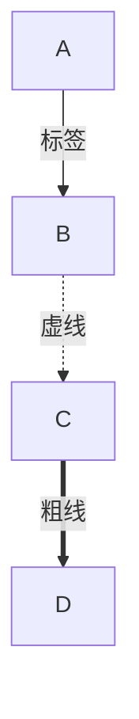
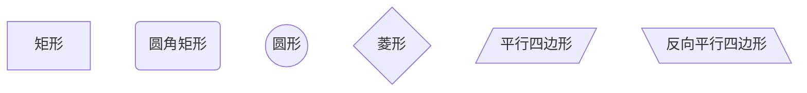

# 流程图功能

MarkFlow Lite 支持使用 Mermaid 语法创建各种类型的流程图和图表。

## 📊 支持的图表类型

### 流程图 (Flowchart)



### 时序图 (Sequence Diagram)



### 甘特图 (Gantt Chart)



### 饼图 (Pie Chart)



### 类图 (Class Diagram)



### 状态图 (State Diagram)



### Git 流程图

```mermaid
gitgraph
    commit id: "初始化"
    branch develop
    commit id: "添加功能A"
    commit id: "添加功能B"
    checkout main
    merge develop
    commit id: "发布v1.0"
```

## 🎨 图表样式自定义

### 主题设置

Mermaid 支持多种主题：

- `default` - 默认主题
- `dark` - 深色主题
- `forest` - 森林主题
- `neutral` - 中性主题

### 自定义配置

在文档开头添加配置：

```markdown

```

## 📝 使用技巧

### 1. 基本语法

- 使用 `graph TD` 创建从上到下的流程图
- 使用 `graph LR` 创建从左到右的流程图
- 节点用 `[]` 表示矩形，`()` 表示圆角矩形，`{}` 表示菱形

### 2. 连接线样式



### 3. 节点样式



### 4. 颜色设置

```mermaid
graph TD
    A[开始]
    B[处理]
    C[结束]
    
    A --> B
    B --> C
    
    classDef start fill:#e1f5fe
    classDef process fill:#fff3e0
    classDef end fill:#f3e5f5
    
    class A start
    class B process
    class C end
```

## 🚀 最佳实践

### 1. 保持简洁

- 避免在单个图表中包含过多元素
- 使用清晰的标签和命名
- 合理安排布局避免重叠

### 2. 语义化设计

- 使用有意义的节点名称
- 添加适当的注释和说明
- 保持一致的颜色和样式

### 3. 响应式设计

- 考虑不同屏幕尺寸的显示效果
- 避免过宽的图表
- 使用合适的字体大小

## 🔗 相关链接

- [Mermaid 官方文档](https://mermaid.js.org/)
- [返回功能特性](./index)
- [数学公式](./math)
- [主题设置](./themes)
