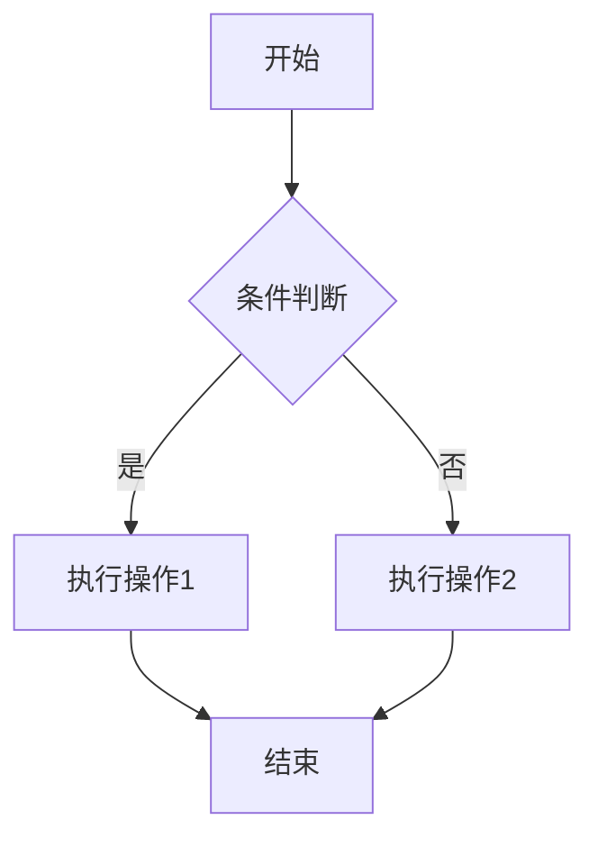
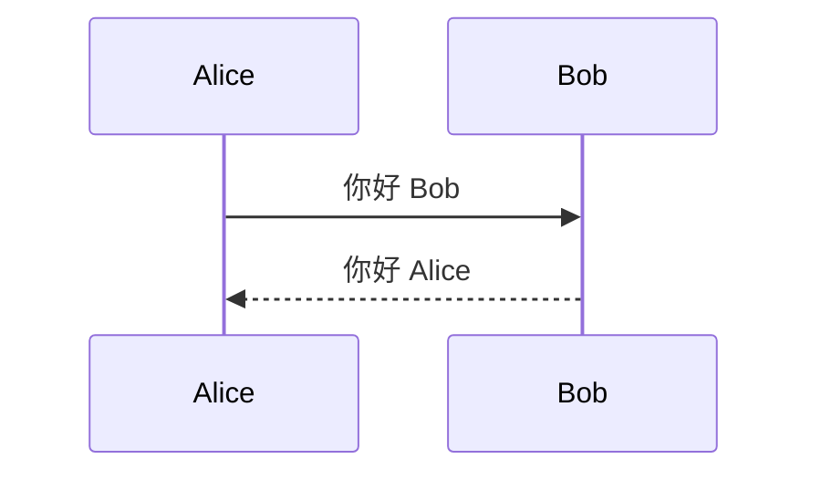

# Markdown 支持

MarkFlow Lite 提供完整而强大的 Markdown 支持，让你的文档编写更加高效和专业。

## 📝 基础语法

### 标题

```markdown
# 一级标题
## 二级标题
### 三级标题
#### 四级标题
##### 五级标题
###### 六级标题
```

### 文本样式

```markdown
**粗体文本**
*斜体文本*
~~删除线~~
***粗斜体***
`行内代码`
```

### 段落和换行

```markdown
这是一个段落。

这是另一个段落，中间有空行。

这是同一行的内容，  
这里使用了两个空格进行换行。
```

### 列表

#### 无序列表
```markdown
- 项目 1
- 项目 2
  - 子项目 2.1
  - 子项目 2.2
- 项目 3

* 也可以使用星号
+ 或者加号
```

#### 有序列表
```markdown
1. 第一步
2. 第二步
3. 第三步
   1. 子步骤 3.1
   2. 子步骤 3.2
```

#### 任务列表
```markdown
- [x] 已完成的任务
- [ ] 未完成的任务
- [ ] 另一个任务
  - [x] 子任务已完成
  - [ ] 子任务未完成
```

### 链接和图片

```markdown
[普通链接](https://example.com)
[带标题的链接](https://example.com "链接标题")
[相对链接](../path/to/file.md)
[锚点链接](#标题)


```

### 引用

```markdown
> 这是一个引用块
> 可以有多行内容
>
> > 嵌套引用
> > 支持多层嵌套

> ### 引用中的标题
> 
> - 引用中的列表
> - 更多项目
> 
> **引用中的粗体**
```

### 代码

#### 行内代码
```markdown
使用 `console.log()` 来输出调试信息。

快捷键 `Ctrl + C` 可以复制内容。
```

#### 代码块
\```javascript
function hello() {
    console.log("Hello, World!");
    return "success";
}
\```

\```python
def fibonacci(n):
    if n <= 1:
        return n
    return fibonacci(n-1) + fibonacci(n-2)
\```

\```bash
# 安装依赖
npm install

# 启动开发服务器
npm run dev
\```

### 表格

```markdown
| 姓名 | 年龄 | 城市 |
|------|------|------|
| 张三 | 25   | 北京 |
| 李四 | 30   | 上海 |
| 王五 | 28   | 广州 |

| 左对齐 | 居中对齐 | 右对齐 |
|:-------|:--------:|-------:|
| 内容1  |  内容2   |  内容3 |
| 内容4  |  内容5   |  内容6 |
```

### 分割线

```markdown
---

***

___
```

## 🚀 扩展语法

### 脚注

```markdown
这是一个有脚注的句子[^1]。

另一个脚注示例[^longnote]。

[^1]: 这是第一个脚注的内容。
[^longnote]: 这是一个较长的脚注，
    可以包含多行内容。
```

### 定义列表

```markdown
术语 1
:   定义 1

术语 2
:   定义 2a
:   定义 2b

HTML
:   超文本标记语言

CSS
:   层叠样式表
```

### 缩写

```markdown
*[HTML]: 超文本标记语言
*[CSS]: 层叠样式表

HTML 和 CSS 是网页开发的基础。
```

### 下划线和上标

```markdown
下划线文本：~下划线~
上标文本：^上标^
H~2~O 是水
E = mc^2^
```

### 高亮

```markdown
==这是高亮文本==

普通文本中的 ==高亮部分==。
```

## 🎨 高级功能

### Emoji 支持

```markdown
:smile: :heart: :thumbsup:
:fire: :star: :rocket:

表情符号可以直接使用 😀 😍 🎉
```

### 任务列表增强

```markdown
- [x] 已完成的任务 ✅
- [ ] 未完成的任务 ⬜
- [-] 进行中的任务 🔄
- [>] 转发的任务 ⏩
```

### 容器和提示框

```markdown
::: tip 提示
这是一个提示框
:::

::: warning 警告
这是一个警告框
:::

::: danger 危险
这是一个危险警告框
:::

::: details 点击查看详情
这是隐藏的内容
:::
```

### 图表支持

```markdown



```

## 🔧 配置选项

### 解析器配置

```javascript
const markdownIt = require('markdown-it')({
    html:         true,        // 启用 HTML 标签
    xhtmlOut:     false,       // 使用 '/' 关闭单标签
    breaks:       false,       // 转换 '\n' 为 '<br>'
    langPrefix:   'language-',  // CSS 语言前缀
    linkify:      true,        // 自动转换 URL 为链接
    typographer:  true,        // 启用智能引号等
    
    // 组件
    highlight: function (str, lang) {
        if (lang && hljs.getLanguage(lang)) {
            try {
                return hljs.highlight(str, { language: lang }).value;
            } catch (__) {}
        }
        return ''; // 使用外部默认转义
    }
});
```

### 扩展插件

```javascript
// 表格插件
const markdownItTable = require('markdown-it-table');

// 任务列表插件
const markdownItTaskLists = require('markdown-it-task-lists');

// 脚注插件
const markdownItFootnote = require('markdown-it-footnote');

// 定义列表插件
const markdownItDeflist = require('markdown-it-deflist');

// 缩写插件
const markdownItAbbr = require('markdown-it-abbr');

// 下标/上标插件
const markdownItSub = require('markdown-it-sub');
const markdownItSup = require('markdown-it-sup');

// 高亮插件
const markdownItMark = require('markdown-it-mark');

// 数学公式插件
const markdownItMath = require('markdown-it-math');
```

## 🎯 最佳实践

### 写作建议

1. **结构清晰**：使用合适的标题层级
2. **语义化**：使用正确的 Markdown 语法表达语义
3. **一致性**：保持文档风格的一致性
4. **可读性**：适当使用空行和缩进

### 性能优化

1. **避免过度嵌套**：过深的嵌套会影响渲染性能
2. **合理使用扩展语法**：只在需要时使用扩展语法
3. **图片优化**：压缩图片，使用合适的格式
4. **缓存策略**：利用缓存提高渲染速度

### 兼容性考虑

1. **标准优先**：优先使用标准 Markdown 语法
2. **渐进增强**：在标准基础上添加扩展功能
3. **降级处理**：为不支持扩展语法的渲染器提供降级方案
4. **测试验证**：在不同环境下测试渲染效果

## 🐛 常见问题

### 语法不生效

1. **检查语法**：确保语法正确无误
2. **检查插件**：确认相关插件已启用
3. **检查配置**：验证解析器配置
4. **检查版本**：确保使用支持的语法版本

### 渲染异常

1. **字符编码**：确认文件编码为 UTF-8
2. **特殊字符**：转义特殊字符
3. **HTML 冲突**：避免 Markdown 和 HTML 冲突
4. **样式冲突**：检查 CSS 样式影响

### 性能问题

1. **文档过大**：分割大文档
2. **图片过多**：优化图片大小
3. **复杂语法**：简化复杂语法结构
4. **渲染频率**：控制渲染频率

## 🎨 示例文档

### 完整示例

```markdown
---
title: MarkFlow Lite 用户手册
date: 2024-01-01
author: MarkFlow Team
tags: [markdown, editor, documentation]
---

# MarkFlow Lite 用户手册

## 概述

MarkFlow Lite 是一个**纯前端**的 Markdown 编辑器，支持实时预览、数学公式、流程图等功能。

## 主要特性

### 1. 实时编辑
- ✅ 所见即所得编辑
- ✅ 语法高亮显示
- ✅ 自动保存功能

### 2. 丰富导出
| 格式 | 特点 | 用途 |
|------|------|------|
| PDF | 格式固定 | 正式文档 |
| HTML | 交互性强 | 网页发布 |
| Markdown | 纯文本 | 版本控制 |

### 3. 云存储支持
1. AWS S3
2. WebDAV
3. 本地存储

## 快速开始

```bash
# 安装
npm install markflow-lite

# 启动
npm run dev
```

## 数学公式

行内公式：$E = mc^2$

块级公式：
$$
\int_{-\infty}^{\infty} e^{-x^2} dx = \sqrt{\pi}
$$

## 流程图


---

*Happy Writing!* 🚀
```

## 🎯 下一步

- [流程图](./flowchart) - 学习创建各种图表
- [数学公式](./math) - 掌握数学公式渲染
- [主题切换](./themes) - 个性化你的界面
- [快捷键](./shortcuts) - 提高编辑效率

## 📚 相关资源

- [CommonMark 规范](https://commonmark.org/)
- [GitHub Flavored Markdown](https://github.github.com/gfm/)
- [Markdown 扩展语法](https://markdown-it.github.io/)
- [Markdown 教程](https://www.markdownguide.org/)\n\n---\n\n**提示**: MarkFlow Lite 支持完整的 Markdown 语法和多种扩展，你可以根据需要选择合适的语法来编写文档。\n\n**建议**: 保持语法的一致性，这样可以让你的文档更加专业和易读。"}