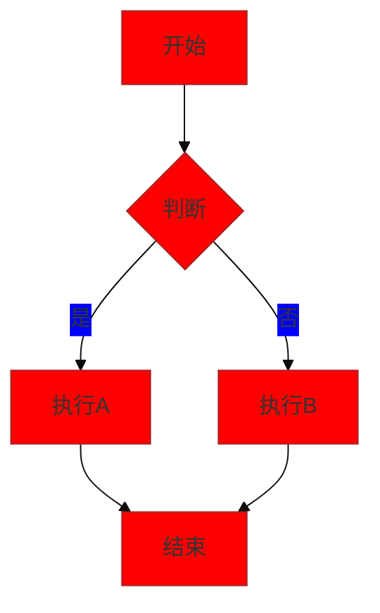

# 主题设置

MarkFlow Lite 提供了灵活的主题系统，支持深色和浅色模式，以及自定义样式配置。

## 🎨 内置主题

### 浅色主题 (Light Theme)

默认的浅色主题，适合在明亮环境下使用：

- **背景色**: 纯白色 (`#ffffff`)
- **文本色**: 深灰色 (`#1f2937`)
- **编辑器背景**: 浅灰色 (`#f9fafb`)
- **边框色**: 中性灰 (`#e5e7eb`)

### 深色主题 (Dark Theme)

护眼的深色主题，适合在昏暗环境下使用：

- **背景色**: 深色 (`#111827`)
- **文本色**: 浅色 (`#f9fafb`)
- **编辑器背景**: 较深灰色 (`#1f2937`)
- **边框色**: 深灰色 (`#374151`)

## 🔄 主题切换

### 手动切换

点击工具栏中的主题切换按钮 🌙/☀️ 即可在深色和浅色主题之间切换。

### 自动切换

MarkFlow Lite 支持根据系统主题自动切换：

1. 检测操作系统的深色/浅色模式设置
2. 自动应用对应的主题
3. 当系统主题改变时实时响应

### 记忆功能

应用会记住您的主题选择：

- 使用浏览器本地存储保存设置
- 下次访问时自动应用上次的主题选择
- 支持跨标签页同步

## 🎯 代码高亮主题

### 浅色模式代码主题

```javascript
// 示例代码 - 浅色主题
function fibonacci(n) {
    if (n <= 1) return n;
    return fibonacci(n - 1) + fibonacci(n - 2);
}

const result = fibonacci(10);
console.log(`第10项斐波那契数: ${result}`);
```

### 深色模式代码主题

在深色模式下，代码块使用专门优化的配色方案：

```python
# 示例代码 - 深色主题
def quick_sort(arr):
    if len(arr) <= 1:
        return arr
    
    pivot = arr[len(arr) // 2]
    left = [x for x in arr if x < pivot]
    middle = [x for x in arr if x == pivot]
    right = [x for x in arr if x > pivot]
    
    return quick_sort(left) + middle + quick_sort(right)

# 测试
numbers = [3, 6, 8, 10, 1, 2, 1]
sorted_numbers = quick_sort(numbers)
print(f"排序结果: {sorted_numbers}")
```

## 📊 预览主题

### 表格样式

| 功能 | 浅色主题 | 深色主题 |
|------|----------|----------|
| 表头背景 | 浅灰色 | 深灰色 |
| 表格边框 | 中性灰 | 深灰色 |
| 斑马纹 | 极浅灰 | 较深灰 |
| 文本颜色 | 深色 | 浅色 |

### 引用块样式

> **浅色主题引用**
> 
> 这是一个引用块的示例。在浅色主题下，引用块使用浅蓝色背景和深色边框。

在深色主题下：

> **深色主题引用**
> 
> 引用块使用深色背景和浅色边框，提供良好的对比度。

## 🔧 自定义设置

### CSS 变量

MarkFlow Lite 使用 CSS 变量实现主题系统，支持自定义：

```css
:root {
  /* 浅色主题变量 */
  --color-bg: #ffffff;
  --color-text: #1f2937;
  --color-border: #e5e7eb;
  --color-editor-bg: #f9fafb;
}

.dark {
  /* 深色主题变量 */
  --color-bg: #111827;
  --color-text: #f9fafb;
  --color-border: #374151;
  --color-editor-bg: #1f2937;
}
```

### 语法高亮配色

代码语法高亮使用 Highlight.js，支持多种主题：

- **浅色模式**: `github` 主题
- **深色模式**: `github-dark` 主题

## 🎨 数学公式主题

### KaTeX 样式

数学公式渲染也会根据主题调整：

浅色主题下的公式：
$$E = mc^2$$

深色主题下的公式会自动调整颜色以确保可读性。

## 📊 Mermaid 图表主题

### 流程图主题

Mermaid 图表也支持主题切换：



### 主题变量

- **浅色模式**: `default` 主题
- **深色模式**: `dark` 主题
- **自定义**: 支持自定义颜色变量

## 💡 使用建议

### 1. 环境适配

- **明亮环境**: 使用浅色主题，减少屏幕反光
- **昏暗环境**: 使用深色主题，减少眼部疲劳
- **长时间工作**: 建议使用深色主题

### 2. 对比度调节

- 确保文本与背景有足够的对比度
- 注意代码块的可读性
- 关注链接和按钮的可见性

### 3. 一致性原则

- 保持整个应用的主题一致性
- 确保所有组件都遵循主题设计
- 注意打印时的显示效果

## 🚀 未来计划

### 即将推出的功能

1. **更多内置主题**: 增加更多预设主题选项
2. **主题编辑器**: 可视化主题自定义工具
3. **导入导出**: 支持主题配置的导入导出
4. **社区主题**: 支持用户分享自定义主题

### 技术改进

1. **性能优化**: 减少主题切换时的延迟
2. **动画效果**: 添加平滑的主题切换动画
3. **无障碍支持**: 改进对比度和可访问性
4. **移动端优化**: 优化移动设备上的主题表现

## 🔗 相关链接

- [Tailwind CSS 深色模式](https://tailwindcss.com/docs/dark-mode)
- [Highlight.js 主题](https://highlightjs.org/static/demo/)
- [Mermaid 主题](https://mermaid.js.org/config/theming.html)
- [返回功能特性](./index)
- [流程图](./flowchart)
- [数学公式](./math)
