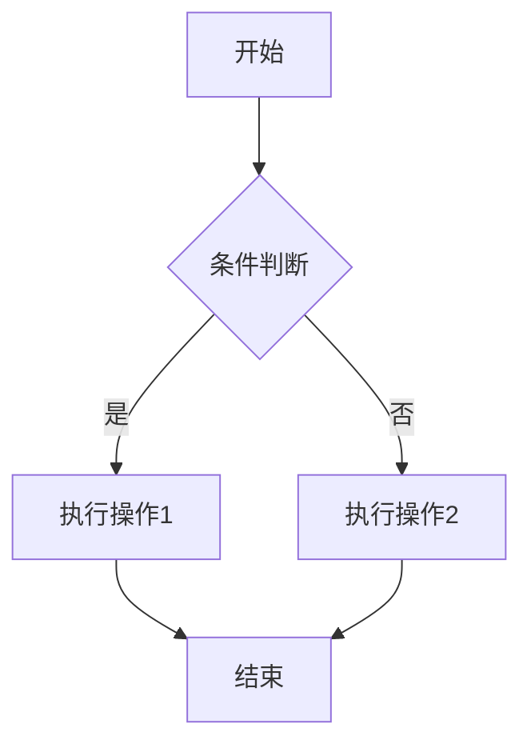

# 基础使用

## 🎯 界面概览

MarkFlow Lite 的界面设计简洁直观，主要分为以下几个区域：

```
┌─────────────────────────────────────────────────────────────┐
│ 顶部工具栏                                                   │
│ ┌─────────┬─────────┬─────────┬─────────┬─────────┬─────────┐ │
│ │  文件   │  编辑   │  视图   │  插入   │  格式   │  导出   │ │
│ └─────────┴─────────┴─────────┴─────────┴─────────┴─────────┘ │
├──────────────────────┬──────────────────────────────────────┤
│                      │                                      │
│     编辑区域          │           预览区域                    │
│                      │                                      │
│   • Markdown 编辑    │        • 实时渲染预览                 │
│   • 语法高亮        │        • 数学公式渲染                 │
│   • 行号显示        │        • 流程图渲染                   │
│   • 自动补全        │        • 代码高亮                     │
│                      │                                      │
├──────────────────────┼──────────────────────────────────────┤
│ 底部状态栏                                              │
│ 字数统计 │ 保存状态 │ 当前主题 │ 光标位置 │ 文件编码 │
└─────────────────────────────────────────────────────────────┘
```

## ✍️ 基本编辑

### 创建新文档

1. 点击顶部工具栏的「文件」→「新建」
2. 或使用快捷键 `Ctrl + N`
3. 输入文档标题
4. 开始编写内容

### 打开现有文档

1. 点击「文件」→「打开」
2. 或使用快捷键 `Ctrl + O`
3. 选择本地的 Markdown 文件
4. 文件内容将自动加载到编辑器中

### 保存文档

1. **自动保存**：默认开启，每 30 秒自动保存到本地存储
2. **手动保存**：
   - 点击「文件」→「保存」
   - 或使用快捷键 `Ctrl + S`
   - 保存到浏览器本地存储

## 📝 Markdown 语法

### 基础语法

```markdown
# 一级标题
## 二级标题
### 三级标题

**粗体文本**
*斜体文本*
~~删除线~~

- 无序列表项 1
- 无序列表项 2
  - 子项

1. 有序列表项 1
2. 有序列表项 2

[链接文本](https://example.com)


> 引用块
> 可以有多行

`行内代码`

```代码块
function hello() {
    console.log("Hello, World!");
}
```

---
水平分割线
```

### 高级语法

```markdown
# 表格
| 标题 1 | 标题 2 | 标题 3 |
|--------|--------|--------|
| 内容 1 | 内容 2 | 内容 3 |
| 内容 4 | 内容 5 | 内容 6 |

# 任务列表
- [x] 已完成的任务
- [ ] 未完成的任务
- [ ] 另一个任务

# 数学公式（LaTeX）
行内公式：$E = mc^2$

块级公式：
$$
\int_{-\infty}^{\infty} e^{-x^2} dx = \sqrt{\pi}
$$

# 流程图（Mermaid）

```

## 🎨 视图模式

MarkFlow Lite 提供三种视图模式：

### 编辑模式
- 只显示编辑区域
- 适合专注写作
- 快捷键：`Ctrl + 1`

### 预览模式
- 只显示预览区域
- 适合查看最终效果
- 快捷键：`Ctrl + 2`

### 分屏模式
- 同时显示编辑和预览
- 实时同步滚动
- 快捷键：`Ctrl + 3`

## ⌨️ 快捷键大全

### 文件操作
| 快捷键 | 功能 |
|--------|------|
| `Ctrl + N` | 新建文档 |
| `Ctrl + O` | 打开文件 |
| `Ctrl + S` | 保存文档 |
| `Ctrl + P` | 打印文档 |

### 编辑操作
| 快捷键 | 功能 |
|--------|------|
| `Ctrl + Z` | 撤销 |
| `Ctrl + Y` | 重做 |
| `Ctrl + X` | 剪切 |
| `Ctrl + C` | 复制 |
| `Ctrl + V` | 粘贴 |
| `Ctrl + F` | 查找 |
| `Ctrl + H` | 替换 |

### 格式操作
| 快捷键 | 功能 |
|--------|------|
| `Ctrl + B` | 粗体 |
| `Ctrl + I` | 斜体 |
| `Ctrl + K` | 插入链接 |
| `Ctrl + Shift + K` | 插入代码块 |
| `Ctrl + Shift + L` | 插入列表 |
| `Ctrl + Shift + T` | 插入表格 |

### 视图操作
| 快捷键 | 功能 |
|--------|------|
| `Ctrl + 1` | 编辑模式 |
| `Ctrl + 2` | 预览模式 |
| `Ctrl + 3` | 分屏模式 |

## 🔍 搜索和替换

1. **搜索**：`Ctrl + F`
   - 输入搜索关键词
   - 支持大小写敏感/不敏感
   - 支持全词匹配

2. **替换**：`Ctrl + H`
   - 输入查找内容
   - 输入替换内容
   - 支持单个替换和全部替换

## 📊 文档统计

状态栏显示以下信息：

- **字数统计**：总字数、字符数
- **行数统计**：总行数
- **阅读时间**：预计阅读时间
- **保存状态**：上次保存时间

## 💡 使用技巧

### 1. 高效写作
- 使用快捷键提高编辑效率
- 利用自动保存功能，避免数据丢失
- 使用分屏模式实时查看效果

### 2. 组织内容
- 使用标题层级组织文档结构
- 使用列表和表格整理信息
- 使用引用块强调重要内容

### 3. 格式化文档
- 保持一致的标题层级
- 合理使用空行分隔段落
- 使用代码块展示代码片段

### 4. 协作分享
- 使用导出功能分享文档
- 生成分享链接进行协作
- 使用云存储同步文档

## 🎯 下一步

- [云存储配置](./cloud-storage) - 学习如何配置云存储
- [导出功能](./export) - 了解各种导出选项
- [功能特性](../features/) - 探索更多高级功能