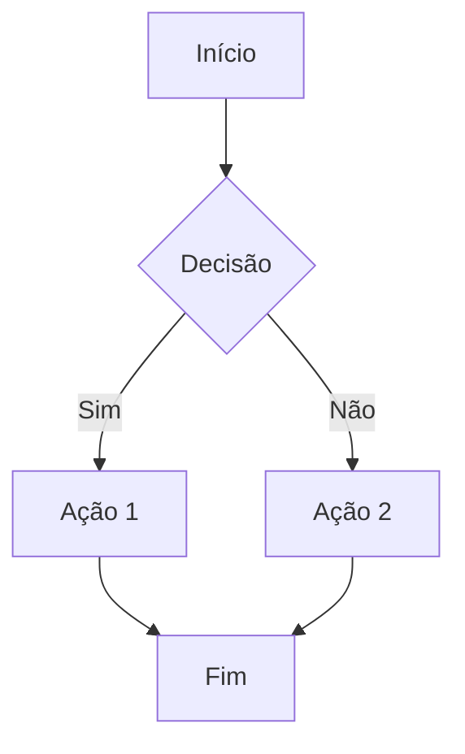

# Uso Básico

Uma vez que você tenha configurado o MarkFlow Lite, aqui está um guia completo sobre como usar todas as suas funcionalidades.

## 🖥️ Interface Principal

### Layout da Aplicação
```
┌─────────────────────────────────────────────────┐
│                    Cabeçalho                    │
├──────────────┬──────────────────┬───────────────┤
│   Árvore de  │     Editor de    │   Visualização│
│   Arquivos   │     Markdown     │   Prévia      │
│              │                  │               │
├──────────────┼──────────────────┼───────────────┤
│              │   Barra de       │               │
│              │   Status         │               │
└──────────────┴──────────────────┴───────────────┘
```

### Componentes Principais
- **Cabeçalho**: Barra de ferramentas principal
- **Árvore de Arquivos**: Navegação de documentos (esquerda)
- **Editor**: Área de edição de Markdown (centro)
- **Visualização Prévia**: Renderização em tempo real (direita)
- **Barra de Status**: Informações do documento (parte inferior)

## ✏️ Edição de Markdown

### Sintaxe Básica
```markdown
# Título 1
## Título 2
### Título 3

**Negrito** e *itálico*
~~Riscado~~ e `código inline`

- Lista não ordenada
  - Sublista
1. Lista ordenada
2. Segundo elemento

[Link](https://exemplo.com)


> Citação de texto
> Segunda linha

---

Tabela | Coluna 2
-------|----------
Linha 1| Conteúdo
Linha 2| Mais conteúdo
```

### Recursos Avançados

#### Fórmulas Matemáticas (KaTeX)
```latex
Inline: $E = mc^2$

Bloco:
$$
\int_{-\infty}^{\infty} e^{-x^2} dx = \sqrt{\pi}
$$
```

#### Diagramas (Mermaid)


#### Blocos de Código com Destaque
```javascript
function cumprimentar(nome) {
    console.log(`Olá, ${nome}!`);
    return true;
}

// Chamar a função
cumprimentar("Mundo");
```

## 🎨 Personalização

### Temas
1. **Tema Claro**: Fundo branco, texto preto
2. **Tema Escuro**: Fundo escuro, texto claro
3. **Automático**: Segue a configuração do sistema

### Configuração do Editor
- **Tamanho da fonte**: 12px - 24px
- **Família da fonte**: Monospace, Sans-serif, Serif
- **Números de linha**: Mostrar/Ocultar
- **Quebra de linha**: Ativar/Desativar
- **Indentação**: Espaços ou tabs

### Visualização Prévia
- **Estilo CSS**: Múltiplos estilos predefinidos
- **Largura máxima**: Personalizável
- **Sincronização de scroll**: Ativar/Desativar

## 📁 Gerenciamento de Arquivos

### Criar Novo Arquivo
1. Clique em "Novo Arquivo" na barra de ferramentas
2. Digite um nome para o arquivo
3. Comece a escrever no editor

### Abrir Arquivos Existentes
- **Do disco**: Arraste e solte arquivos
- **Da nuvem**: Conecte serviços de armazenamento
- **Arquivos recentes**: Lista de documentos recentes

### Salvar Arquivos
- **Salvamento automático**: Salva automaticamente a cada 30 segundos
- **Salvamento manual**: Ctrl+S (Cmd+S no Mac)
- **Salvar como**: Ctrl+Shift+S

### Organização
- **Pastas**: Crie estrutura de diretórios
- **Tags**: Marque documentos para busca fácil
- **Favoritos**: Marque documentos importantes

## 🔍 Busca e Navegação

### Busca no Documento
- **Buscar**: Ctrl+F
- **Buscar e substituir**: Ctrl+H
- **Expressões regulares**: Suporte completo
- **Busca sensível a maiúsculas**: Opcional

### Navegação Rápida
- **Ir para linha**: Ctrl+G
- **Navegação de títulos**: Painel de esquema
- **Breadcrumbs**: Caminho de navegação
- **Minimap**: Visão geral do documento

## 🚀 Atalhos de Teclado

### Gerais
| Atalho | Ação |
|--------|------|
| `Ctrl + N` | Novo arquivo |
| `Ctrl + O` | Abrir arquivo |
| `Ctrl + S` | Salvar |
| `Ctrl + Shift + S` | Salvar como |
| `Ctrl + Z` | Desfazer |
| `Ctrl + Y` | Refazer |

### Edição
| Atalho | Ação |
|--------|------|
| `Ctrl + X` | Recortar linha |
| `Ctrl + C` | Copiar linha |
| `Ctrl + V` | Colar |
| `Ctrl + D` | Duplicar linha |
| `Ctrl + L` | Selecionar linha |
| `Alt + ↑/↓` | Mover linha |

### Formatação
| Atalho | Ação |
|--------|------|
| `Ctrl + B` | **Negrito** |
| `Ctrl + I` | *Itálico* |
| `Ctrl + K` | Criar link |
| `Ctrl + Shift + K` | Excluir linha |

### Visualização
| Atalho | Ação |
|--------|------|
| `Ctrl + +` | Aumentar zoom |
| `Ctrl + -` | Diminuir zoom |
| `Ctrl + 0` | Resetar zoom |
| `F11` | Tela cheia |

## 🔄 Sincronização e Colaboração

### Modo Offline
- Todos os arquivos disponíveis sem internet
- Sincronização automática ao reconectar
- Indicador de status da conexão

### Função de Backup
- **Histórico de versões**: Até 50 versões por arquivo
- **Recuperação automática**: Restaura trabalho perdido
- **Exportação de backup**: Baixa todos os dados

### Compartilhar Documentos
- **Links públicos**: Gera URLs compartilháveis
- **Modo somente leitura**: Para revisão
- **Exportar**: HTML, PDF, Markdown

## 💡 Dicas de Produtividade

### Organização do Trabalho
1. **Use estrutura de pastas** para projetos grandes
2. **Aplique tags consistentes** para busca fácil
3. **Aproveite os snippets** para texto repetitivo
4. **Configure modelos** para tipos de documento comuns

### Otimização do Fluxo de Trabalho
1. **Memorize atalhos principais** para operações frequentes
2. **Use visualização dividida** para comparar documentos
3. **Ative a visualização automática** para feedback imediato
4. **Configure salvamento automático** frequente para segurança

### Melhores Práticas
1. **Estrutura clara de títulos** para navegação fácil
2. **Links internos** para conectar documentos relacionados
3. **Imagens otimizadas** para melhor desempenho
4. **Consistência no estilo** para profissionalismo

Pronto para recursos mais avançados? Continue com [Armazenamento na Nuvem](./cloud-storage) ou [Exportação](./export).
